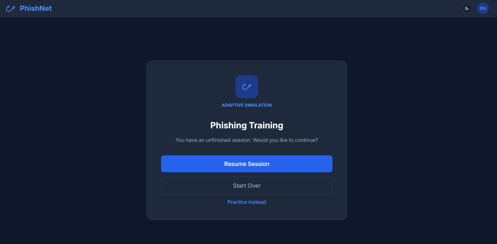
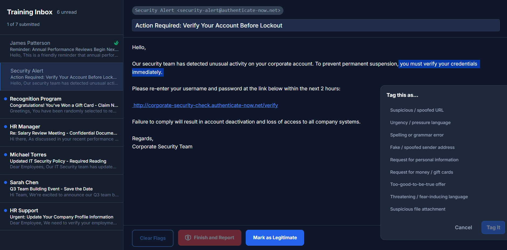
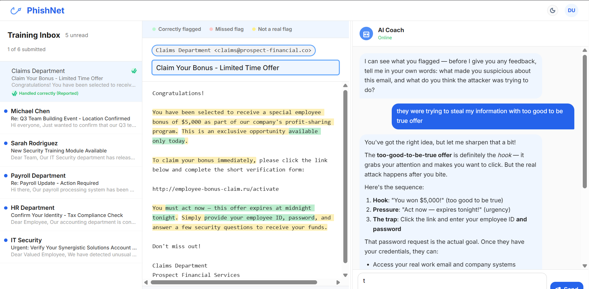
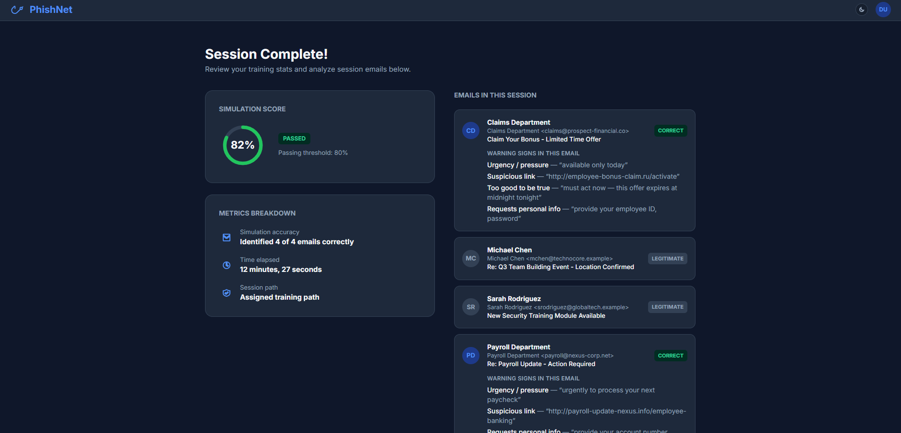
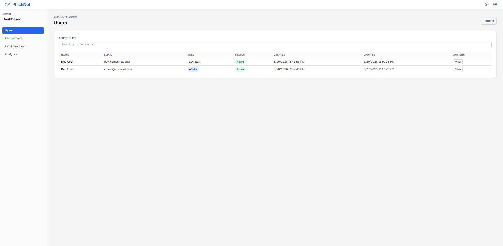
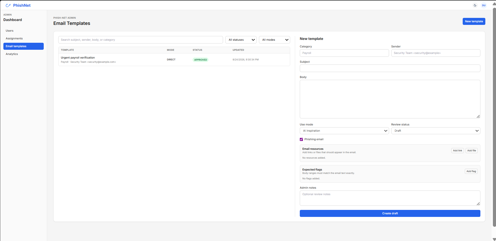
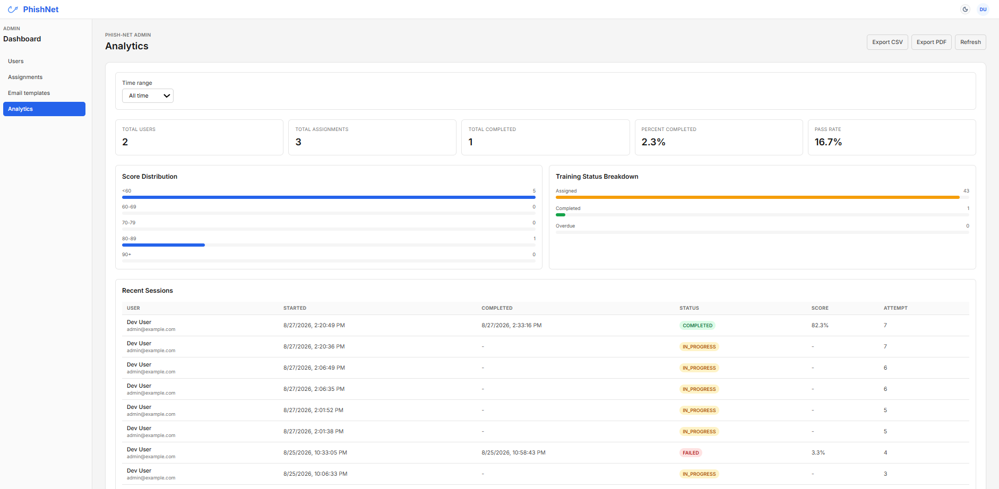

# Phish-Net

Phish-Net is a phishing-awareness training application for organizations. Learners work through a simulated inbox, identify suspicious details, explain their reasoning, and receive streamed AI coaching. Administrators manage users, assignments, analytics, and custom training templates.

## Features

- AI-generated training sessions with phishing and legitimate emails
- Outlook-style inbox with body-text highlighting and sender, subject, URL, and attachment flags
- Server-side scoring that keeps expected answers hidden until submission
- AI coaching chat with streamed responses and mandatory learner explanations
- Practice sessions that do not affect official records
- Admin user management, assignments, analytics, and custom templates
- Okta SAML authentication with a localhost-only development login
- PostgreSQL persistence through Prisma

## Screenshots

### Learner experience









### Administrator experience







## Technology

- Nuxt 4, Vue 3, and TypeScript
- Tailwind CSS
- Nitro server routes
- PostgreSQL and Prisma
- Amazon Bedrock using a configurable Anthropic Claude model
- Okta SAML through Passport and `@node-saml/passport-saml`
- Docker Compose for local PostgreSQL development
- Vitest for automated tests

## Requirements

- Node.js 22 or later
- npm
- Docker Desktop, for the local PostgreSQL container
- AWS Bedrock access for AI-generated sessions
- Okta SAML configuration for production authentication

Kaggle credentials are only needed when loading the optional source email dataset. The dataset is downloaded into a local, Git-ignored cache and is never sent to the browser as a raw dataset.

## Quick Start

1. Install dependencies:

	```powershell
	npm install
	```

2. Create the local environment file:

	```powershell
	Copy-Item .env.example .env
	```

3. Start PostgreSQL:

	```powershell
	docker compose up -d db
	```

4. Set a local development identity in `.env`:

	```dotenv
	AUTH_DEV_EMAIL=admin@example.com
	ADMIN_EMAILS=admin@example.com
	NUXT_SESSION_PASSWORD=local-development-secret-change-me
	```

	The development login is available only on `localhost` and is disabled when `NODE_ENV=production`.

5. Apply migrations and start Nuxt:

	```powershell
	npx prisma migrate dev
	npm run dev -- --port 3001
	```

6. Open [http://localhost:3001](http://localhost:3001). The local development SSO route will use `AUTH_DEV_EMAIL` instead of contacting Okta.

## Environment Variables

| Variable | Required | Purpose |
|---|---:|---|
| `DATABASE_URL` | Yes | PostgreSQL connection string |
| `NUXT_SESSION_PASSWORD` | Production | Session cookie signing secret |
| `AUTH_DEV_EMAIL` | Local development | Localhost-only login identity |
| `ADMIN_EMAILS` | Yes for admins | Comma-separated admin email addresses |
| `AWS_REGION` | For AI | AWS region containing the Bedrock model |
| `AWS_PROFILE` | Optional | AWS profile used by the SDK |
| `AWS_ACCESS_KEY_ID` | Optional | AWS access key when not using a profile or role |
| `AWS_SECRET_ACCESS_KEY` | Optional | AWS secret when not using a profile or role |
| `BEDROCK_MODEL_ID` | For AI | Bedrock model identifier |
| `SAML_ISSUER` | Production auth | Service provider issuer |
| `SAML_ENTRY_POINT` | Production auth | Okta SAML login URL |
| `SAML_IDP_CERT` | Production auth | Okta signing certificate |
| `BASE_URL` | Production auth | Public app URL and SAML callback base |
| `KAGGLE_USERNAME` | Dataset loading | Kaggle account username |
| `KAGGLE_KEY` | Dataset loading | Kaggle API key |

Copy `.env.example` to `.env` and replace the empty values. Never commit `.env` or real credentials.

## Dataset Loading

On server startup, the application checks whether the `email_templates` table is empty. When it is empty and Kaggle credentials are present, it downloads the configured Kaggle dataset into `.cache/kaggle`, parses CSV and JSON files as text, normalizes valid rows, deduplicates them by SHA-256 body hash, and inserts them into PostgreSQL.

The imported dataset templates remain available as training seeds but are excluded from the admin authoring list. The Email Templates dashboard starts empty for a fresh database, allowing administrators to add their own templates. Dataset ingestion is skipped when templates already exist, and ingestion failures do not prevent the server from starting.

## Application Workflows

### Learner

1. Start or resume an assigned session, or start a practice session.
2. Review generated emails in the inbox.
3. Mark an email legitimate or tag suspicious elements.
4. Submit the email and review the revealed annotations.
5. Explain the reasoning in the AI chat before continuing.
6. Complete the session and review the score summary.

### Administrator

1. Sign in through Okta SAML, or use the localhost development login.
2. Review users and their session history.
3. Create assignments with deadlines.
4. Create, review, approve, reject, or archive custom email templates.

## Scoring

Only phishing emails with expected flags contribute to the score. Body flags are matched by text overlap and category; sender, subject, URL, and attachment flags are matched by zone. Each phishing email uses a 50% per-email pass threshold, and the final session score is the average partial-credit rate across scored phishing emails. The session pass threshold is 80%. Legitimate emails are excluded from scoring but still receive educational feedback.

## Project Structure

```text
app/                 Nuxt pages, components, composables, and styles
server/api/          Authenticated session and admin API routes
server/utils/        Auth, Bedrock, Kaggle, Prisma, scoring, and session helpers
server/plugins/      Startup validation and dataset ingestion
prisma/              Schema, migrations, and generated client output
tests/               Vitest handler and scoring tests
docker-compose.yml   Local PostgreSQL service and app container definition
SPEC.md              Detailed product and technical specification
```

## Validation

```powershell
npx tsc --noEmit
npm test -- --run
npm run build
```

## Security Notes

- Expected flags are kept server-side until the learner submits an email.
- Admin authorization is checked on every admin API request.
- Session ownership is checked before learner actions are accepted.
- Deactivated users cannot continue using the application.
- Credentials are read from environment variables and are not exposed to the client.
- The development login is restricted to localhost and disabled in production.
- Email resources are displayed by the training UI without downloading attachments.
- Dataset files and local environment files are excluded by `.gitignore`.

## Status

This repository is a functional portfolio project and internal-training prototype. Production deployment still requires organization-specific Okta configuration, AWS Bedrock access, database hosting, dependency maintenance, rate limiting, and operational monitoring.